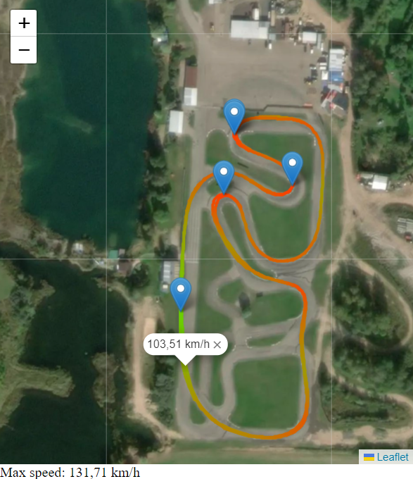

# Telemetry data visualizer



#

Example data.csv from RaceChrono using Garmin GLO 2 with ~10hz rate

|timestamp   |fragment_id|lap_number|elapsed_time|distance_traveled|altitude|altitude_precision|bearing |coordinate_precision|device_update_rate|fix_type|lateral_acc|latitude  |longitude |longitudinal_acc|satellites|speed   |
|------------|-----------|----------|------------|-----------------|--------|------------------|--------|--------------------|------------------|--------|-----------|----------|----------|----------------|----------|--------|
|unix time   |           |          |s           |m                |m       |DOP               |deg     |DOP                 |Hz                |        |G          |deg       |deg       |G               |sats      |m/s     |
|            |           |          |            |                 |100: gps|100: gps          |100: gps|100: gps            |100: gps          |100: gps|100: gps   |100: gps  |100: gps  |100: gps        |100: gps  |100: gps|
|1685377018.7|0          |4         |343.1       |3596.046         |14.2    |0.9               |229.8   |0.7                 |6.43676           |2.0     |0.91728    |56.599357 |23.6904862|0.39166         |13.0      |15.037  |
|1685377018.8|0          |4         |343.2       |3597.57          |14.2    |0.9               |226.4   |0.7                 |6.49026           |2.0     |0.90399    |56.5993478|23.6904677|0.43902         |13.0      |14.95   |
|1685377018.9|0          |4         |343.3       |3599.115         |14.2    |0.9               |223.9   |0.7                 |6.55818           |2.0     |0.89835    |56.599338 |23.6904498|0.47164         |13.0      |16.066  |

csv:
`
timestamp,fragment_id,lap_number,elapsed_time,distance_traveled,altitude,altitude_precision,bearing,coordinate_precision,device_update_rate,fix_type,lateral_acc,latitude,longitude,longitudinal_acc,satellites,speed
unix time,,,s,m,m,DOP,deg,DOP,Hz,,G,deg,deg,G,sats,m/s
,,,,,100: gps,100: gps,100: gps,100: gps,100: gps,100: gps,100: gps,100: gps,100: gps,100: gps,100: gps,100: gps
1685377018.7,0,4,343.1,3596.046,14.2,0.9,229.8,0.7,6.43676,2.0,0.91728,56.599357,23.6904862,0.39166,13.0,15.037
1685377018.8,0,4,343.2,3597.57,14.2,0.9,226.4,0.7,6.49026,2.0,0.90399,56.5993478,23.6904677,0.43902,13.0,14.95
1685377018.9,0,4,343.3,3599.115,14.2,0.9,223.9,0.7,6.55818,2.0,0.89835,56.599338,23.6904498,0.47164,13.0,16.066
`

#
## Vue 3 + Vite + Vue Leaflet


```sh
yarn
yarn dev
```